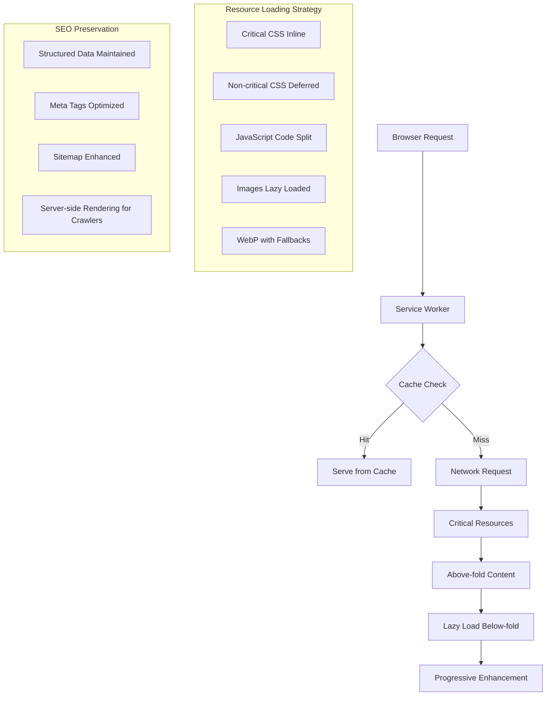

# Design Document

## Overview

The Angel Stones website performance optimization will enhance the existing well-designed SPA while preserving its excellent SEO implementation and sophisticated dark theme design. The optimization focuses on improving Core Web Vitals, reducing bundle sizes, implementing modern performance patterns, and fixing critical functionality bugs without disrupting the current user experience or search engine visibility.

**Key Design Principles:**
- Preserve existing SEO excellence (structured data, sitemap, meta tags)
- Maintain current design system and branding
- Fix critical functionality bugs (forms, email, image organization)
- Implement performance optimizations transparently
- Ensure backward compatibility
- Progressive enhancement approach

**Critical Bug Fixes Required:**
- Sales rep form PDF generation and email functionality
- Contact form Gmail integration (moved from cPanel email)
- Image organization and management system improvements
- Product category image display optimization

## Architecture

### Current Architecture Analysis
The website currently uses:
- Single large HTML file (2000+ lines) with inline critical CSS
- jQuery-based JavaScript with multiple separate files
- Owl Carousel for color gallery
- Dynamic color loading via PHP API
- Comprehensive structured data implementation
- Mobile-responsive CSS with custom properties

### Optimized Architecture



## Components and Interfaces

### 1. Performance Manager Component

**Purpose:** Central performance orchestration
**Location:** `js/performance/performance-manager.js`

```javascript
class PerformanceManager {
    constructor() {
        this.metrics = new Map();
        this.observers = [];
        this.loadingStrategy = new LoadingStrategy();
    }
    
    // Core Web Vitals monitoring
    initializeMetrics() {
        this.observeLCP();
        this.observeFID();
        this.observeCLS();
    }
    
    // Resource loading optimization
    optimizeResourceLoading() {
        this.loadingStrategy.prioritizeCritical();
        this.loadingStrategy.deferNonCritical();
    }
}
```

### 2. Image Optimization System

**Purpose:** Intelligent image loading and format selection
**Location:** `js/performance/image-optimizer.js`

```javascript
class ImageOptimizer {
    constructor() {
        this.webpSupport = this.checkWebPSupport();
        this.lazyLoader = new IntersectionObserver(this.handleIntersection.bind(this));
    }
    
    // WebP detection and fallback
    optimizeImageFormat(imageSrc) {
        if (this.webpSupport) {
            return imageSrc.replace(/\.(jpg|jpeg|png)$/i, '.webp');
        }
        return imageSrc;
    }
    
    // Lazy loading implementation
    enableLazyLoading(images) {
        images.forEach(img => this.lazyLoader.observe(img));
    }
}
```

### 3. Code Splitting Manager

**Purpose:** Dynamic JavaScript loading
**Location:** `js/performance/code-splitter.js`

```javascript
class CodeSplitter {
    constructor() {
        this.loadedModules = new Set();
        this.moduleCache = new Map();
    }
    
    // Dynamic import with caching
    async loadModule(moduleName) {
        if (this.loadedModules.has(moduleName)) {
            return this.moduleCache.get(moduleName);
        }
        
        const module = await import(`./modules/${moduleName}.js`);
        this.moduleCache.set(moduleName, module);
        this.loadedModules.add(moduleName);
        return module;
    }
}
```

### 4. SEO Preservation Layer

**Purpose:** Maintain search engine optimization
**Location:** `js/seo/seo-manager.js`

```javascript
class SEOManager {
    constructor() {
        this.structuredData = this.loadStructuredData();
        this.metaManager = new MetaTagManager();
    }
    
    // Preserve existing structured data
    maintainStructuredData() {
        // Keep existing JSON-LD implementation
        // Enhance with performance metrics
    }
    
    // Dynamic meta tag updates
    updateMetaTags(section) {
        this.metaManager.updateForSection(section);
    }
}
```

### 5. Form Enhancement System

**Purpose:** Enhance existing form handlers and fix bugs
**Location:** Optimize existing `process_order_quote.php` and `send_email.php`

```php
// Enhance existing process_order_quote.php
class FormEnhancer {
    private $existingEmailConfig;
    
    public function __construct() {
        // Reuse existing email_config.php
        define('SECURE_ACCESS', true);
        require_once 'email_config.php';
        $this->existingEmailConfig = [
            'host' => SMTP_HOST,
            'port' => SMTP_PORT,
            'username' => SMTP_USERNAME,
            'password' => SMTP_PASSWORD
        ];
    }
    
    // Fix sales rep form to send to support@theangelstones.com
    public function fixSalesRepFormRecipient() {
        // Update existing process_order_quote.php recipient
        // Change from 'da@theangelstones.com' to 'support@theangelstones.com'
    }
    
    // Enhance existing contact form in send_email.php
    public function enhanceContactForm() {
        // Optimize existing send_email.php for better Gmail integration
        // Add better error handling and validation
    }
    
    // Add PDF generation to existing form handler
    public function addPDFGeneration() {
        // Enhance existing process_order_quote.php with PDF attachment
        // Use existing PHPMailer setup, just add PDF generation
    }
}
```

### 6. Image Organization System

**Purpose:** Manage and organize images efficiently without disrupting existing structure
**Location:** `php/images/image-manager.php`

```php
class ImageManager {
    private $imageBasePath;
    private $allowedFormats;
    
    public function __construct() {
        $this->imageBasePath = __DIR__ . '/../../images/';
        $this->allowedFormats = ['jpg', 'jpeg', 'png', 'webp'];
    }
    
    // Organize images while preserving existing structure
    public function organizeImages() {
        // Scan existing structure
        $currentStructure = $this->scanImageStructure();
        
        // Create organized structure without breaking existing paths
        $this->createOptimizedStructure($currentStructure);
        
        // Generate thumbnails and WebP versions
        $this->generateOptimizedVersions();
    }
    
    // Smart image serving based on category and device
    public function serveImage($category, $imageName, $size = 'full') {
        $imagePath = $this->findImagePath($category, $imageName);
        
        // Serve WebP if supported, otherwise original format
        if ($this->supportsWebP()) {
            $webpPath = $this->getWebPVersion($imagePath);
            if (file_exists($webpPath)) {
                return $webpPath;
            }
        }
        
        return $imagePath;
    }
    
    // Product category image optimization
    public function getProductCategoryImages($category) {
        $categoryPath = $this->imageBasePath . 'products/' . $category;
        
        if (!is_dir($categoryPath)) {
            return [];
        }
        
        $images = [];
        $files = scandir($categoryPath);
        
        foreach ($files as $file) {
            if ($this->isValidImageFile($file)) {
                $images[] = [
                    'name' => pathinfo($file, PATHINFO_FILENAME),
                    'path' => 'images/products/' . $category . '/' . $file,
                    'thumbnail' => $this->getThumbnailPath($category, $file),
                    'webp' => $this->getWebPPath($category, $file)
                ];
            }
        }
        
        return $images;
    }
}

## Data Models

### Performance Metrics Model

```javascript
class PerformanceMetrics {
    constructor() {
        this.fcp = null;      // First Contentful Paint
        this.lcp = null;      // Largest Contentful Paint
        this.fid = null;      // First Input Delay
        this.cls = null;      // Cumulative Layout Shift
        this.ttfb = null;     // Time to First Byte
        this.timestamp = Date.now();
    }
    
    // Core Web Vitals thresholds
    static get THRESHOLDS() {
        return {
            FCP: { good: 1800, poor: 3000 },
            LCP: { good: 2500, poor: 4000 },
            FID: { good: 100, poor: 300 },
            CLS: { good: 0.1, poor: 0.25 }
        };
    }
}
```

### Resource Loading Model

```javascript
class ResourceLoadingStrategy {
    constructor() {
        this.criticalResources = [
            'css/critical.min.css',
            'js/performance/performance-manager.js',
            'images/hero-video-poster.webp'
        ];
        
        this.deferredResources = [
            'css/color-carousel.css',
            'js/color-carousel.js',
            'js/specials-integration.js'
        ];
        
        this.lazyResources = [
            'images/colors/*.webp',
            'js/modules/gallery.js',
            'css/print.css'
        ];
    }
}
```

## Error Handling

### Performance Error Recovery

```javascript
class PerformanceErrorHandler {
    constructor() {
        this.fallbackStrategies = new Map();
        this.errorLog = [];
    }
    
    // WebP fallback strategy
    handleImageError(img) {
        if (img.src.includes('.webp')) {
            img.src = img.src.replace('.webp', '.jpg');
        }
    }
    
    // Service Worker fallback
    handleServiceWorkerError() {
        // Graceful degradation to normal loading
        console.warn('Service Worker unavailable, using standard loading');
        this.loadResourcesDirectly();
    }
    
    // Critical CSS fallback
    handleCSSLoadError() {
        // Load full CSS if critical CSS fails
        const fallbackCSS = document.createElement('link');
        fallbackCSS.rel = 'stylesheet';
        fallbackCSS.href = 'css/style.css';
        document.head.appendChild(fallbackCSS);
    }
}
```

### Form Error Handling

```php
class FormErrorHandler {
    private $logFile;
    
    public function __construct() {
        $this->logFile = __DIR__ . '/../../logs/form-errors.log';
    }
    
    // Handle sales rep form errors
    public function handleSalesRepFormError($error, $formData) {
        $this->logError('Sales Rep Form', $error, $formData);
        
        // Fallback: Send simple email without PDF if PDF generation fails
        if (strpos($error, 'PDF') !== false) {
            return $this->sendSimpleEmail($formData);
        }
        
        return false;
    }
    
    // Handle contact form Gmail errors
    public function handleContactFormError($error, $formData) {
        $this->logError('Contact Form', $error, $formData);
        
        // Fallback: Try alternative email method
        if (strpos($error, 'SMTP') !== false) {
            return $this->sendFallbackEmail($formData);
        }
        
        return false;
    }
    
    // Handle image organization errors
    public function handleImageError($error, $imagePath) {
        $this->logError('Image Processing', $error, ['path' => $imagePath]);
        
        // Continue with original image if optimization fails
        return $imagePath;
    }
    
    private function logError($type, $error, $data) {
        $logEntry = [
            'timestamp' => date('Y-m-d H:i:s'),
            'type' => $type,
            'error' => $error,
            'data' => $data,
            'ip' => $_SERVER['REMOTE_ADDR'] ?? 'unknown'
        ];
        
        file_put_contents($this->logFile, json_encode($logEntry) . "\n", FILE_APPEND | LOCK_EX);
    }
}
```

### Image Organization Error Recovery

```php
class ImageOrganizationHandler {
    private $backupPath;
    private $errorHandler;
    
    public function __construct() {
        $this->backupPath = __DIR__ . '/../../images/backup/';
        $this->errorHandler = new FormErrorHandler();
    }
    
    // Safe image organization with rollback capability
    public function safeOrganizeImages() {
        try {
            // Create backup before reorganization
            $this->createBackup();
            
            // Perform organization
            $imageManager = new ImageManager();
            $result = $imageManager->organizeImages();
            
            // Verify organization didn't break existing paths
            if (!$this->verifyImagePaths()) {
                throw new Exception('Image paths verification failed');
            }
            
            return $result;
            
        } catch (Exception $e) {
            // Rollback on error
            $this->rollbackImages();
            $this->errorHandler->handleImageError($e->getMessage(), 'organization');
            return false;
        }
    }
    
    // Verify existing image paths still work
    private function verifyImagePaths() {
        $criticalPaths = [
            'images/colors/',
            'images/products/',
            'images/logo.png',
            'images/video-poster-mobile.webp'
        ];
        
        foreach ($criticalPaths as $path) {
            if (!file_exists($path) && !is_dir($path)) {
                return false;
            }
        }
        
        return true;
    }
}

## Testing Strategy

### Performance Testing Framework

```javascript
class PerformanceTestSuite {
    constructor() {
        this.tests = [
            this.testCoreWebVitals,
            this.testResourceLoading,
            this.testImageOptimization,
            this.testCodeSplitting,
            this.testSEOPreservation
        ];
    }
    
    // Core Web Vitals testing
    async testCoreWebVitals() {
        const metrics = await this.measureMetrics();
        
        assert(metrics.fcp < 1800, 'FCP should be under 1.8s');
        assert(metrics.lcp < 2500, 'LCP should be under 2.5s');
        assert(metrics.fid < 100, 'FID should be under 100ms');
        assert(metrics.cls < 0.1, 'CLS should be under 0.1');
    }
    
    // SEO preservation testing
    async testSEOPreservation() {
        const structuredData = this.extractStructuredData();
        const metaTags = this.extractMetaTags();
        
        assert(structuredData.length > 0, 'Structured data should be present');
        assert(metaTags.title, 'Title tag should exist');
        assert(metaTags.description, 'Description should exist');
    }
}
```

### Automated Performance Monitoring

```javascript
class PerformanceMonitor {
    constructor() {
        this.reportingEndpoint = '/api/performance-metrics';
        this.batchSize = 10;
        this.metricsQueue = [];
    }
    
    // Real User Monitoring (RUM)
    collectRealUserMetrics() {
        new PerformanceObserver((list) => {
            for (const entry of list.getEntries()) {
                this.queueMetric({
                    name: entry.name,
                    value: entry.value,
                    timestamp: entry.startTime
                });
            }
        }).observe({ entryTypes: ['navigation', 'paint', 'largest-contentful-paint'] });
    }
    
    // Batch reporting to avoid performance impact
    async reportMetrics() {
        if (this.metricsQueue.length >= this.batchSize) {
            await fetch(this.reportingEndpoint, {
                method: 'POST',
                body: JSON.stringify(this.metricsQueue.splice(0, this.batchSize))
            });
        }
    }
}
```

## Implementation Phases

### Phase 1: Foundation (Week 1)
- Implement Performance Manager
- Set up Core Web Vitals monitoring
- Create critical CSS extraction
- Implement basic lazy loading

### Phase 2: Image Optimization (Week 2)
- WebP conversion and serving
- Responsive image implementation
- Advanced lazy loading with Intersection Observer
- Image placeholder system

### Phase 3: Code Splitting (Week 3)
- Break down main JavaScript bundle
- Implement dynamic imports
- Create module loading strategy
- Optimize third-party scripts

### Phase 4: Advanced Optimizations (Week 4)
- Service Worker implementation
- Resource preloading strategy
- Performance monitoring dashboard
- SEO validation and enhancement

## Design Decisions and Rationales

### 1. Preserve Existing Design System
**Decision:** Keep current CSS custom properties and design tokens
**Rationale:** The existing design is professional and well-implemented. Changes would risk breaking the visual consistency and require extensive testing.

### 2. Maintain SEO Excellence
**Decision:** Preserve all existing structured data and meta implementations
**Rationale:** The current SEO implementation is comprehensive and effective. Any changes could negatively impact search rankings.

### 3. Progressive Enhancement Approach
**Decision:** Implement optimizations as enhancements rather than replacements
**Rationale:** Ensures backward compatibility and graceful degradation for older browsers.

### 4. Component-Based Architecture
**Decision:** Create modular performance components
**Rationale:** Allows for easier maintenance, testing, and future enhancements without affecting core functionality.

### 5. Real User Monitoring Integration
**Decision:** Implement RUM alongside synthetic testing
**Rationale:** Provides actual user experience data to validate optimization effectiveness and identify real-world performance issues.